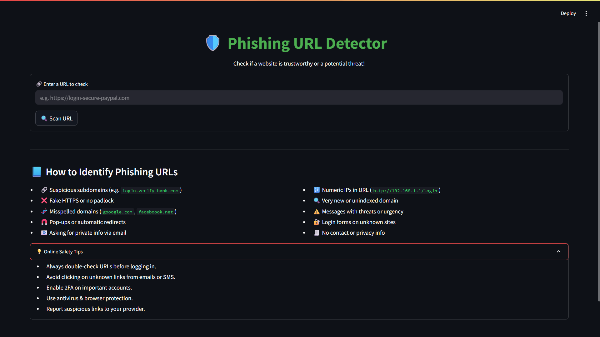

# 🔐 Phishing URL Detector

An intelligent, machine-learning-powered web application to detect whether a given URL is **safe** or a **potential phishing threat**. Built with `Streamlit`, it provides a simple, real-time interface for identifying malicious URLs.

 

---
## 📸 Screenshot



## 🌐 Features

- 🔍 Real-time URL scanning
- ✅ Clear result: “Safe” or “Potential Phishing Threat”
- 📚 Educational tips to avoid phishing scams
- 🎨 Clean, modern UI (dark mode compatible)
- 🤖 Powered by a trained Random Forest Classifier

---

## 🛠 Tech Stack

- **Frontend**: Streamlit
- **Backend**: Python (scikit-learn, pandas)
- **Feature Extraction**: Manual + `tldextract`
- **Model**: RandomForestClassifier

---

## 🚀 Getting Started

### 1️⃣ Clone this Repository

```bash
git clone https://github.com/your-username/phishing-url-detector.git
cd phishing-url-detector
```
### 2️⃣ Set Up Virtual Environment (Recommended)
```bash
python -m venv venv
# Windows
venv\Scripts\activate
# macOS/Linux
source venv/bin/activate
```

### 3️⃣ Install Dependencies
```bash
pip install -r requirements.txt
```

### 4️⃣ Train the Model (Optional)
If model/phishing_model.pkl is not available, run:
```bash
python train_model.py
```

### 5️⃣ Run the Web App
```bash
streamlit run app.py
```
### 📂 Project Structure
```bash
phishing-url-detector/
│
├── model/
│   └── phishing_model.pkl         # Trained ML model
├── train_model.py                 # Script to train the model
├── predict_url.py                 # CLI test script
├── app.py               # Streamlit Web UI
├── requirements.txt
└── README.md
```

### 🧠 How it Works
#### The model uses features like:
- IP address in URL
- Length of URL
- Use of @ or // redirects
- SSL certificate presence
- Domain age, registration length
- Abnormal anchor tags or iFrames

These features are extracted and passed to the trained Random Forest model to predict whether a URL is legitimate or phishing.

### 📚 Dataset
dataset download link: https://www.kaggle.com/datasets/akashkr/phishing-website-dataset?resource=download

### 🛡 Disclaimer
This tool is intended for educational and awareness purposes only. Always exercise caution when browsing or submitting information online.

### 👨‍💻 Author - Sudarshan T S
- 📧 Mail: acharyasudarshan6268@gmail.com
- 📌 LinkedIn: https://www.linkedin.com/in/sudarshan-t-s-858714259/

### 📜 License
This project is licensed under the MIT License.


